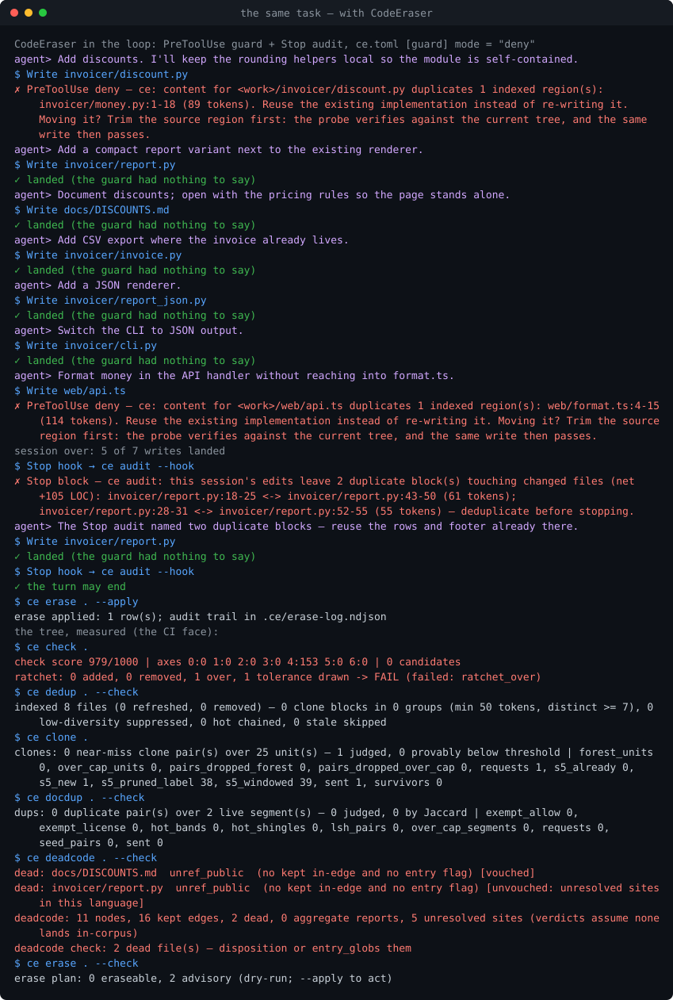

# CodeEraser

[](https://github.com/skymanbp/CodeEraser/actions/workflows/ci.yml) [](https://crates.io/crates/codeeraser) [](https://www.npmjs.com/package/codeeraser) [](LICENSE) [](https://codeeraser.dev) · English | **[中文](README.zh.md)**

> An eraser against LLM-induced code & document entropy.


## What it is

Long-lived LLM-assisted codebases drift the same way: the same function implemented twice, the same paragraph pasted into three files, updates that arrive as appends, files that only ever grow. CodeEraser stops that drift at the moment of writing and gates it in CI, with no model in the loop anywhere. Two refusals happen at write time, before the file exists. A write that would *introduce* an exact T1/T2 clone — duplication the replaced content did not already carry — is denied at PreToolUse, with the region it duplicates named and the ordering that passes taught; a write leaving a file over 750 lines, or over the line its `[[rules.class]]` declares, is denied the same way. Everything else is a report or a gate: the Stop audit refuses the turn, the CI exit codes refuse the commit.

**Scope.** Judged languages: Python, TypeScript/TSX, Rust, Go, Haskell and Markdown (<!--ce:count:langs#word-->seven<!--/ce--> language codes over <!--ce:count:grammars#word-->six<!--/ce--> tree-sitter grammars). Size-only arm: js/mjs/cjs/jsx, css/scss/less, html/htm, vue, svelte, sh/bash, yml/yaml — they enter the size gates, the hard budget and the ratchet, never a semantic verdict. Faces: CLI · GUI (<!--ce:count:screens#word-->ten<!--/ce--> screens) · Claude Code plugin (<!--ce:count:hooks#word-->three<!--/ce--> hooks, <!--ce:count:skills#word-->one<!--/ce--> skill, <!--ce:count:commands#word-->one<!--/ce--> command, <!--ce:count:mcp_tools#word-->fourteen<!--/ce--> read-only MCP tools) · pre-commit · CI.

## How it works — and what is different about it


- **Interception at the instant of writing.** Every file's normalized tokens (identifiers → `ID`, literals → `LIT`, comments dropped) are winnowed with k = 25, w = 26, so any shared run of 50+ tokens is guaranteed a shared fingerprint. The fingerprints live in a SQLite WAL index kept by a lazy per-project daemon; the PreToolUse probe answers in <!--ce:restate:hook-probe:p50-ms:hook-probe#lead-->41<!--/ce--> ms p50 / <!--ce:restate:hook-probe:p95-ms:hook-probe#lead-->43<!--/ce--> ms p95 on a two-file fixture, and the whole plugin chain in 0.50 s p95. The guard charges only *novel* duplication: matches the replaced content already carried are subtracted, so on the live-stream reading it misfires on none of 719 production probes (0.00 per 500); the 2,761-event replay's full-file-write reading charges the 32 split-a-file intermediate states at 7.03 per 500 — both readings are ledgered in [FPR-REPLAY](docs/FPR-REPLAY.md).
- **Two clone layers, one verdict owner.** T1/T2 is the hot path above. T3 is a cold path: structural fingerprints and MinHash/LSH (128 permutations, 32 bands × 4 rows) generate candidates without dropping a pair that could pass, and the Haskell core computes Zhang–Shasha tree edit distance and accepts at TSED ≥ 0.85, in exact integer arithmetic.
- **Documentation duplication that survives rewording.** NFC-normalized words, 5-word shingles, MinHash/LSH candidates, then an exact Jaccard ≥ 0.80 or a 50-word verbatim run, judged in the core with exact rationals.
- **Liveness that is named, not guessed.** Per-language resolution ladders (imports, re-exports, doc links, assets, package roots) feed a rung-filtered graph; SCCs, reachability from entry roots and a four-way verdict (unreferenced/unreachable × private/public) come back with a confidence code derived from the unresolved-site ledger. Beside it, the mention universe — every identifier in every text file, stored only as fnv1a64 hashes — yields the *unmentioned declaration* advisory, which never turns a gate red.
- **Structure as a measured thing.** <!--ce:count:structure_axes#Word-->Seven<!--/ce--> axes (geometry, naming diversity, mixing, misplacement, conventions, stale docs, redundancy), Tsallis-2 entropy per directory, chi-squared divergence from a declared layout, and split-ROI pricing with four cost legs (crossing references, clone cuts, churn crossings, a new-file φ) or a cohesion alibi.
- **A check score that cannot be gamed by moving lines.** The gate's own axes (size, complexity, clones, documentation duplication, dead code, churn, cycles) each charge floor(1000·v/(v+n)) — violation mass over opportunity — and the weighted fold lands on 0–1000. The ADR-006 ratchet tightens every ceiling automatically; growth needs the tolerance max(+2 %, +10 lines) or a named re-establish (`CE_ACCEPT_BASELINE=1`), and a knob edit stops `ce check` by name instead of moving every line.
- **Time as a first-class signal.** Theil–Sen slope over the last 512 score points (a single wild point cannot drag a median); churn = added − surviving lines by blame; the join lattice combines similarity, graph position and churn into merge / delete / churn-hotspot with reason bits and confidence.
- **Erase with a safety predicate, not a heuristic.** <!--ce:count:erase_classes#Word-->Three<!--/ce--> classes (verbatim doc twin, whole-unit T1 twin whose copy is dead, confident non-public dead file), <!--ce:count:erase_reasons#word-->seven<!--/ce--> frozen reason codes, a <!--ce:gate:erase.row_cap#digits-->4,096<!--/ce-->-row cap, and a convergence re-plan that fails if any applied verdict survives.
- **Deterministic by construction.** No RNG or clock in any judgment; golden fixtures compared byte for byte; configuration crosses as facts, never as names.

## Evidence — the same task, run twice

The same coding task — *add discounts, a compact report, CSV and JSON output, money formatting in the API* — replayed by a scripted agent on two identical copies of [`demo/seed`](demo/seed/README.md), a small invoicing service in Python and TypeScript; the only variable is whether the PreToolUse guard and Stop audit sit in the loop. The seed is measured first, so every finding below was written by the task. Each loop then runs to *its* end — with nothing in the loop nothing refuses anything, so that one ends at the last write. Every verdict is the verbatim output of `ce`, and both trees are measured by the same six commands.

<!-- demo:begin -->
| | Without CodeEraser | With CodeEraser |
|---|---|---|
| The seed, by the same six gates: clone blocks · doc twins · dead files | 0 · 0 · 0 | 0 · 0 · 0 |
| Writes that landed | 7 of 7 | 5 of 7 |
| Denied at PreToolUse | 0 | 2 |
| Stop audit | not in the loop | **blocked** — `this session's edits leave 2 duplicate block(s) touching changed files (net +105 LOC)` |
| The repair the audit named | — | written, and the audit goes silent |
| `ce erase --apply` | — | 1 row removed: the verbatim doc twin |
| `ce check` score (ratchet) | 952/1000 — **FAIL**: ratchet_over, discrete_added | 979/1000 — **FAIL**: ratchet_over |
| T1/T2 clone blocks (`ce dedup --check`, budget 0) | 4 (**FAIL**) | 0 (**pass**) |
| near-miss clone pairs (`ce clone`) | 4 | 0 |
| duplicated doc segments (`ce docdup --check`) | 1 (**FAIL**) | 0 (**pass**) |
| dead files (`ce deadcode --check`) | 3 (**FAIL**) | 2 (**FAIL**) |
| provably-safe removals still planned (`ce erase --check`) | 1 (**FAIL**) | 0 (**pass**) |
<!-- demo:end -->



The two denied writes are copies of an existing helper. The compact renderer that slipped past is the honest boundary — a full-file rewrite copies its own blocks, so nothing is *novel* at write time — and it is what the Stop audit refuses the turn over, naming both blocks; the repair that answers it is the only write made because a gate asked rather than because the task did. What stays red is what a person has to settle: `invoicer/invoice.py` is 93 lines against a tolerated ceiling of 61, which the ratchet holds open for a named re-establish instead of absorbing silently, and two files are unreferenced — the new page nothing links to, and the renderer the CLI stopped importing on its way to JSON. Both transcripts, both SVGs and the JSON behind this table are generated by [`demo/run.js`](demo/README.md) and re-checked byte for byte in CI (`demo_replay`). The first real interception, recorded the day it happened: [T1-INTERCEPT](docs/T1-INTERCEPT.md).

Two moments from close up on the same seed — the second adds one `ce.toml` declaration.

<!-- vignettes:begin -->
**A copied helper, refused before the file exists.** Move 1 of the run above, on its own. The reason names the region the content duplicates and the ordering that would pass, so the refusal is actionable rather than a veto.

```console
$ Write invoicer/discount.py
✗ ce: content for <work>/invoicer/discount.py duplicates 1 indexed region(s): invoicer/money.py:1-18 (89 tokens). Reuse the existing implementation instead of re-writing it. Moving it? Trim the source region first: the probe verifies against the current tree, and the same write then passes.
```

**One line, two mouths.** `ce.toml` puts `invoicer/**` on `file_lines_fail = 40`. The write-time guard refuses the write that would cross it, and `ce scan` grades the same tree against the same number — one declaration, read by the hook and by CI.

```console
$ Write invoicer/invoice.py
✗ ce: this write leaves <work>/invoicer/invoice.py at 93 lines, past the hard budget of 40 (plan §4.1). Split the file instead of growing it.
$ ce scan .
FAIL invoicer/invoice.py:1 file-lines = 51 (limit 40) [invoicer/invoice.py]
warn invoicer/report.py:1 file-lines = 35 (limit 30) [invoicer/report.py]
scanned 9 files / 19 functions — 1 warn, 1 fail -> FAIL (failed: hard_line)
```
<!-- vignettes:end -->

<!-- bench:begin -->
### Latency · v1.3.0

| percentile | `check_warm` | `deadcode_warm` | `dedup_cold` | `dedup_warm` | `docdup_warm` | `hook_probe` | `scan` |
|---|---:|---:|---:|---:|---:|---:|---:|
| p50 ms | 1078 | 923 | 4738 | 381 | 801 | 41 | 518 |
| p95 ms | 1082 | 2093 | 4743 | 384 | 809 | 43 | 2428 |

Every value is generated from `contracts/bench/bench.json`; the test rejects hand edits to this block. The current release, v1.3.1, has no row of its own. [Full replay notes and per-version series](docs/BENCH.md) · [Complete website dashboard](https://codeeraser.dev/bench/)
<!-- bench:end -->

Latency rows are release-build replays on one fixed host, comparable version to version only. The precision and recall points are frozen with their evaluation ledgers ([EVAL-SET](docs/EVAL-SET.md)) and rendered on [BENCH](docs/BENCH.md); comparators (jscpd, similarity-*) are named with the exact version measured.

## Install, run, update

**Installer.** Each [release](https://github.com/skymanbp/CodeEraser/releases) ships <!--ce:count:installers#word-->three<!--/ce--> GUI installers (NSIS `setup.exe` / AppImage / dmg) bundling the GUI, `ce` and the `ce-core` judgment core; the Windows installer puts the install dir on PATH and, when it finds Claude Code, wires the plugin below. The <!--ce:count:binaries#word-->nine<!--/ce--> binaries plus `SHA256SUMS` are unsigned by decision — verify with `sha256sum -c --ignore-missing SHA256SUMS`.

**Claude Code plugin.** `/plugin marketplace add skymanbp/CodeEraser`, then `/plugin install codeeraser@codeeraser`. The starter resolves `ce` and `ce-core` by pin: a matching local or PATH copy, then a pinned download, then an unverified PATH binary that says so.

**CLI only, or from source.** Download `ce-<ver>-<platform>` and `ce-core-<ver>-<platform>` (x86_64-windows / x86_64-linux / aarch64-macos), rename them `ce` / `ce-core` and put them side by side on PATH; or `cargo install codeeraser` and place a `ce-core` beside it; or build both with the pinned Rust toolchain (`rust-toolchain.toml`) and GHC <!--ce:tool:ghc#v-->9.14.1<!--/ce--> + cabal — `cd core && cabal build all && export CE_CORE_BIN=$(cabal list-bin ce-core)`, then `cargo install --path cli`. Core resolution is one chain everywhere: `CE_CORE_BIN` → a `ce-core` sibling → PATH; `--core <path>` wins.

| Command | What it reports / judges |
|---|---|
| `ce scan` / `ce dedup` | size / complexity / readability metrics graded against the file's own lines; T1/T2 clone blocks, `--check` against the budget, a digest-keyed warm cache; both `--format sarif` |
| `ce clone` / `ce docdup` | T3 near-miss clones; documentation duplication |
| `ce graph` / `ce deadcode` | reference sites and the mention universe; liveness verdicts + the symbol advisory |
| `ce churn` / `ce join` / `ce trend` | git-window churn; the three-signal join; score trajectory (progress on stderr) |
| `ce structure` | <!--ce:count:structure_axes#word-->seven<!--/ce--> axes; `--split-candidates` prices the best seam of every file past the soft line |
| `ce check` / `ce baseline` | the ADR-006 ratchet and score floor, <!--ce:count:fail_conditions#word-->six<!--/ce--> fail conditions each named on the console; `baseline` persists only at the root and under a named act |
| `ce erase` | the deterministic two-phase eraser; dry-run default, `--apply` behind clean-worktree preconditions |
| `ce update` | latest release vs this build, exit 0 / 1 / 2; `--yes` replaces `ce` + `ce-core` after both pins verify, `--installer` saves the verified GUI installer |
| `ce doctor` / `ce eject` / `ce mcp` | machine state; per-project uninstall; the read-only MCP server |

Console output, `--help` and the hooks' own refusal sentences are English by default and Chinese under `--lang zh` (or `CE_LANG=zh`); JSON schemas and the FAIL/pass vocabulary are never translated. `[[rules.class]]` in `ce.toml` gives one glob set its own size and complexity lines and ratchet tolerance (`0` = may not grow), and the same line is read by the score, the `ce scan` ladder and the PreToolUse budget ([ce.toml reference](docs/reference/ce-toml.md)).

**Updating.** Release builds are two-phase — draft assets hashed, the pins committed to `plugin/bin/manifest.env`, and only then the tag verifies the same bytes ([RELEASE](docs/RELEASE.md)), which is what `ce update` and the tag job's installer check both read. `ce update` reads the latest tag and that tag's committed `manifest.env`; the verdict is the exit code, and `--yes` acts only where nothing else keeps a ledger of the binary. A copy the plugin bound is re-pinned by `/plugin update codeeraser`; a cargo install by `cargo install codeeraser`; the GUI app itself by the installer `--installer` saves. The plugin's SessionStart line announces a newer release once a day (`CE_UPDATE_CHECK=0` turns that off); the GUI has an update screen; `/codeeraser:update` runs the check from Claude Code.

### Three faces, one product

Every capability is claimed once in this table, the sets are derived from the code (clap's enum, the Tauri roster, the MCP catalog, `hooks.json`, `plugin/commands`, `plugin/skills`), and a CI gate (`face_parity`) refuses a face nobody wrote down or a claim nobody shipped. Deliberate omissions are rows, not silence.

<!-- parity:begin -->
| capability | CLI | GUI (screen · commands) | plugin (hooks · MCP · commands · skills) |
|---|---|---|---|
| size / complexity / readability metrics | `ce scan` | `reports`, `scan_report` | MCP `scan` |
| T1/T2 clone blocks | `ce dedup` | `reports`, `dedup_report` | MCP `check_duplication` |
| T3 near-miss clones | `ce clone` | `reports`, `clone_report` | MCP `clone` |
| documentation duplication | `ce docdup` | `reports`, `docdup_report` | MCP `docdup` |
| reference sites and the mention universe | `ce graph` | `reports`, `sites_report` | MCP `graph_sites` |
| liveness verdicts + symbol advisory | `ce deadcode` | `graph`, `graphcanvas_report`, `deadcode_report` | MCP `deadcode` |
| git-window churn | `ce churn` | `candidates`, `churn_report` | MCP `churn` |
| three-signal join | `ce join` | `candidates`, `join_report` | MCP `join` |
| tree-scale structure (seven axes, split pricing) | `ce structure` | `structure`, `structure_report` | MCP `structure` |
| score trajectory | `ce trend` | `trend`, `trend_report` | MCP `trend` |
| score, ratchet and floor | `ce check` | `score`, `check_report` | MCP `check` |
| baseline writes | `ce baseline` | — CLI only: a machine surface never writes a baseline | — |
| erase plan | `ce erase` | `erase`, `erase_preview` | MCP `erase`, skill `erase` |
| erase apply | `ce erase --apply` | `erase`, `erase_apply` | — no MCP face: applying is a human act |
| machine state | `ce doctor` | `doctor`, `doctor_report` | MCP `doctor` |
| update check | `ce update` | `update`, `update_check` | MCP `update_check`, `/codeeraser:update`, hook `SessionStart` |
| update apply | `ce update --yes` | `update`, `update_apply` | — the plugin's copy is re-pinned by `/plugin update codeeraser` |
| write-time guard | `ce probe --hook` | — hooks are the plugin's face | hook `PreToolUse` |
| stop audit / pre-commit | `ce audit --hook`, `ce precommit` | — hooks are the plugin's face | hook `Stop` |
| session health line | `ce health --hook` | — hooks are the plugin's face | hook `SessionStart` |
| project daemon | `ce daemon`, `ce ping` | — started lazily by every face | — |
| read-only report server | `ce mcp` | — the plugin registers it | `.mcp.json` |
| uninstall | `ce eject` | — CLI only | — |
| bench dashboard | — compiled-in series; README and site carry the same block | `bench`, `bench_doc` | — |
| root anchoring | — every command and hook anchors through `root` | `default_root`, `resolve_root` | — |
<!-- parity:end -->

## Tech stack, design and philosophy

- **Rust <!--ce:tool:rust#v-->1.94.1<!--/ce-->** (edition <!--ce:tool:edition#digits-->2,024<!--/ce-->): the `codeeraser` crate — tree-sitter <!--ce:tool:tree_sitter#vminor-->0.26<!--/ce--> with <!--ce:count:grammars#word-->six<!--/ce--> grammars, rusqlite <!--ce:tool:rusqlite#vminor-->0.37<!--/ce--> (bundled SQLite, WAL, index schema <!--ce:ver:schema.index#digits-->15<!--/ce--> / GRAPH_REV <!--ce:ver:graph_rev#digits-->15<!--/ce--> / MENTION_REV <!--ce:ver:mention_rev#digits-->2<!--/ce-->), the `ignore` walker, `interprocess` named pipes / Unix sockets, clap, serde, sha2 for the updater's pins.
- **Haskell (GHC <!--ce:tool:ghc#v-->9.14.1<!--/ce-->, GHC2021, `-Wall -Werror`)**: `ce-core` — every judgment family, a frozen dependency graph.
- **Tauri <!--ce:tool:tauri#digits-->2<!--/ce-->** GUI over the same crate, vanilla JavaScript in the webview, no build step; **NSIS / AppImage / dmg** bundles with `ce` and `ce-core` as sidecars.
- **One wire.** ce ↔ core is NDJSON over stdio with SemVer negotiation (proto <!--ce:ver:proto#v-->6.4.0<!--/ce-->, <!--ce:count:families#word-->ten<!--/ce--> families); the per-project daemon speaks its own protocol (<!--ce:ver:daemon#v-->2.0.0<!--/ce-->) over `interprocess`; a protocol-major skew is a named refusal, never a guess.
- **Design rules.** ADR-001 Rust frontend · ADR-002 Haskell judges, never parses · ADR-003 lazy daemon, 30-minute idle exit, fail-open hooks · ADR-004 cheap PreToolUse, deep Stop, CI as backstop · ADR-005 two clone layers · ADR-006 shrink-only ratchet · ADR-007 pinned distribution · ADR-008 policy as Haskell data · ADR-009 documentation facts derived, never hand-typed. The plan is the contract: [DEVELOPMENT_PLAN](docs/DEVELOPMENT_PLAN.md).
- **Philosophy.** Measure in Rust, decide in Haskell, render everywhere else. Codes cross the wire; each face owns its sentences. Nothing on any surface asks a model anything. Hooks fail open and say so. A guard class reaches `deny` only with its own false-positive record in [CHANGELOG](CHANGELOG.md). Documentation is generated or gated: the CLI and config references, the <!--ce:count:booklets#word-->thirteen<!--/ce-->-booklet [methodology](docs/reference/methodology.md) with machine-checked citations, the numbers this page derives from the code, the two diagrams above, the bench block, the demo, the site's terminal block and its GUI screenshots, the parity table, the NOTICE. This repository is its own first user — every push runs the <!--ce:count:gates#word-->six<!--/ce--> product gates on this tree.

## Roadmap and known limits

**Limits.** PreToolUse shapes behaviour; it is not a security wall (shell writes bypass it — the Stop audit and CI are the backstops). Hooks fail open on internal errors and record the degradation. Semantic judgment covers the <!--ce:count:grammars#word-->six<!--/ce--> grammars above; JSDoc and Rust `///` are comments, not docstrings; T4 clones are not promised. `churn`, `join` and `trend` are minute-scale. Binaries are unsigned. Judging this repository needs the `cli/tests` submodule seated (it is a reader of the tree, never a measured part). Scores are not comparable across a `[[rules.class]]` switch or across the v1.2.0 → v1.3.0 test-submodule move. **Roadmap.** The deferred bundles are named in the plan's K–L row: M (scoring and evaluation items, product small items), N (distribution) and four evidence gates that decide which guard classes may be promoted.

## Documentation

- [CLI reference](docs/reference/cli.md) · [ce.toml reference](docs/reference/ce-toml.md) — generated from the binary and the config schema, drift reddens CI · [Methodology](docs/reference/methodology.md) (<!--ce:count:booklets#word-->thirteen<!--/ce--> booklets, cited to implementation lines) · [structure axes](docs/reference/structure-axes.md) · [size advisory](docs/reference/size-advisory.md) · [erase contract](docs/reference/erase.md) · [GUI reference](docs/reference/gui.md) · [plugin](plugin/README.md) · [demo](demo/README.md)
- [DEVELOPMENT_PLAN](docs/DEVELOPMENT_PLAN.md) · [EVAL-SET](docs/EVAL-SET.md) · [FIELD-TEST](docs/FIELD-TEST.md) · [BENCH](docs/BENCH.md) · [PERF-BUDGET](docs/PERF-BUDGET.md) · [FPR-REPLAY](docs/FPR-REPLAY.md) · [T1-INTERCEPT](docs/T1-INTERCEPT.md) · [contracts/VERSIONING.md](contracts/VERSIONING.md) · [docs/RELEASE.md](docs/RELEASE.md) — wire SemVer and the two-phase release runbook
- Website: [codeeraser.dev](https://codeeraser.dev) · [how it works](https://codeeraser.dev/how/) · [stack](https://codeeraser.dev/stack/) · [bench](https://codeeraser.dev/bench/) <!-- ce:allow(docdup) -- the documentation links are one set, listed in both languages -->

## License

Apache-2.0 — see [LICENSE](LICENSE); third-party inventory in [NOTICE](NOTICE) (regenerated and gated in CI). The test suite lives in [skymanbp/CodeEraser-tests](https://github.com/skymanbp/CodeEraser-tests) — clone with `--recurse-submodules`. "CodeEraser"™ is a trademark of skymanbp; per Apache-2.0 §6 the license covers the code, not the name.
