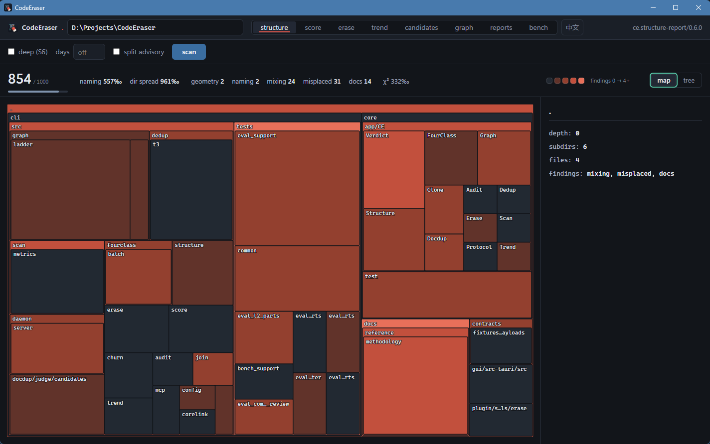
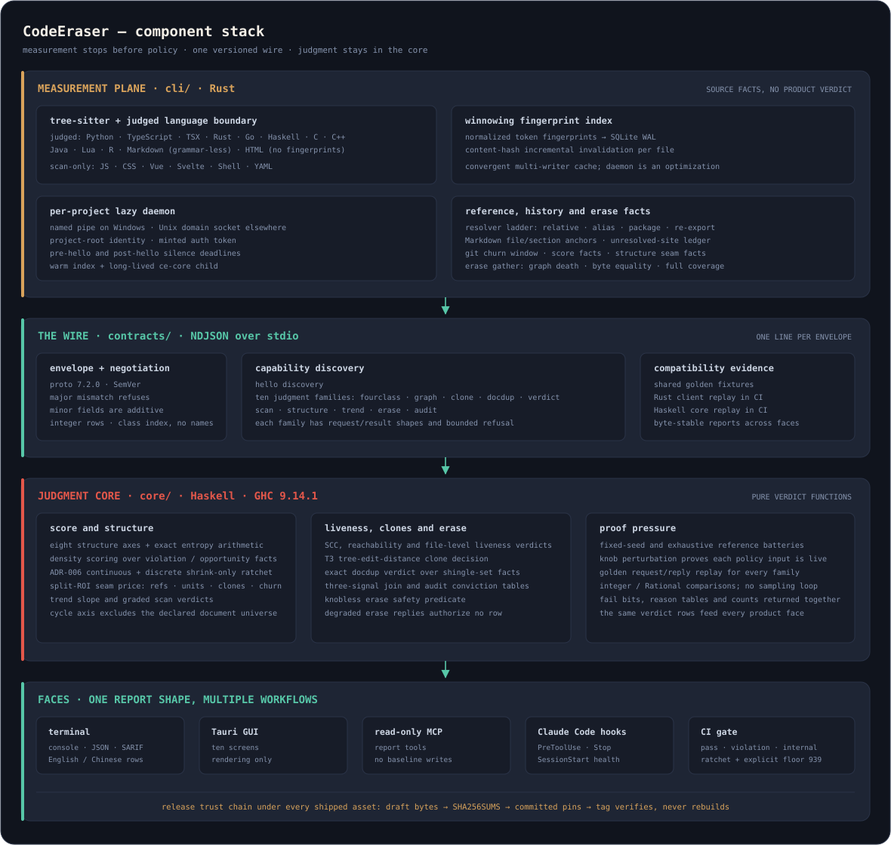

# CodeEraser

[](https://github.com/skymanbp/CodeEraser/actions/workflows/ci.yml) [](https://crates.io/crates/codeeraser) [](https://www.npmjs.com/package/codeeraser) [](LICENSE) [](https://codeeraser.dev)

English | **[中文](README.zh.md)**

> An eraser against LLM-induced code & document entropy.



LLMs drift toward stacking and patching over long-lived work: the same function implemented twice,
the same fact written in three places, updates that arrive as appends, files that only ever grow.
CodeEraser fights that drift at the moment of writing — a Rust CLI + Tauri GUI in front of a Haskell
judgment core, shipped as a Claude Code plugin with PreToolUse/Stop interception, a read-only MCP report surface, pre-commit, and CI exit codes.

## What CodeEraser does

1. **It refuses a duplicate before it exists.** A write that would *introduce* an exact T1/T2 clone — duplication the content being replaced did not already carry — is denied at PreToolUse; the interception happens at writing time, not in a report you read afterwards, and a denied move is told the ordering that passes.
2. **It refuses a file past its hard line.** A write that leaves a file over 750 lines — or over the line that file's `[[rules.class]]` declares — is denied the same way.
3. **It finds documentation written twice.** Repeated paragraphs, comments and docstrings anywhere in the tree, with `--check` turning the finding into a CI exit code.
4. **It finds the clones that editing disguised.** Near-miss blocks are matched by tree edit distance over syntax, so a renamed and re-ordered copy still answers for itself.
5. **It finds what nothing reaches.** A file-level reference graph carries four-way liveness verdicts and cycle membership: dead code and dead documents are named, not guessed at. Beside the verdicts, a symbol-level advisory lists the declarations no other file in the tree spells — reported with a visibility code, never judged.
6. **It erases only what is provably safe.** Dead files, verbatim document twins and whole-unit exact clones — planned first, applied only from a clean worktree, and never by asking a model to rewrite your code.
7. **It prices the seam before you split.** Every file past the soft line gets its best split seam costed, or a written cohesion alibi for why it should be left whole.
8. **It scores the whole tree and holds a floor that only tightens.** Seven structural axes produce one score; `ce check --fail-under` gates it, and per-file ceilings from the accepted baseline can be tightened by cleanup but never loosened silently.
9. **It watches the trajectory, not just today.** Score history over mainline commits, git-window churn, and a three-signal join that puts churn, duplication and liveness in one verdict.
10. **It reports through the surfaces you already use.** Terminal, GUI, read-only MCP server, Claude Code hooks, pre-commit and CI exit codes — every one of them rendering the same verdicts from the same core.

## Status

🏁 **v1.2.0 — released.** The K round cleared the post-1.1.0 debt inventory end to end. The wire crossed
three majors (4.0.0 retired the superseded erase class 0 — its frozen slot kept and refused by name,
5.0.0 retired the legacy graph flags column, 6.0.0 widened the baseline's config fingerprint) and landed
the `symbols` table — deduped `[node, visibility]` pairs saying which files declare something and how
visibly, the producer flag bit 0 never had, which finally lets the export surface be acted on:
`unref_public` reporting, an erase reason that refuses to plan a public API away, and the join lattice
reading the same bit. The baseline now fingerprints the **whole** `ce.toml` (`knobs_digest`), so any config edit stops
`ce check` by name instead of quietly moving every line, and a class can freeze its own growth with
`ratchet_tolerance = 0`. The guard's duplicate-write rule was re-measured by resurrecting the FPR replay
over 2,761 real edit events and now denies only duplication a write *introduces*
([ledger](docs/FPR-REPLAY.md)). `ce scan` and `ce dedup` learned `--format sarif` (this repository's own
CI uploads to GitHub code scanning), warm analyze serves a digest-keyed result cache (555 → 294 ms
measured here), the daemon client got a whole-conversation deadline, the long measurements paint stderr
progress, and the GUI grew its ninth screen (doctor). Earlier: v1.1.0 = the path rulepack
(`[[rules.class]]`), v1.0.1 = installer wiring, v1.0.0 = every milestone of the locked plan. Installers,
[crates.io](https://crates.io/crates/codeeraser), the npm pointer and
[codeeraser.dev](https://codeeraser.dev) are live at 1.2.0. A repository that declares no class — this one
included — scores exactly as under 1.1.0; declaring one moves the lines its files are measured against,
so scores across that switch are **not comparable** and need a named `CE_ACCEPT_BASELINE=1` re-establish.

The locked plan is the contract: [docs/DEVELOPMENT_PLAN.md](docs/DEVELOPMENT_PLAN.md). This repository gates itself with its own scanner,
clone ratchet, baseline and deadcode/docdup checks on every push to `main` (plus pull requests and a weekly scheduled run).

## Install

Install surfaces are layered: the **installer** is the GUI+CLI superset,
the **plugin** the guard layer on any base, the rest CLI-only.

**Installer (recommended).** Every [release](https://github.com/skymanbp/CodeEraser/releases) ships three GUI installers
(NSIS `setup.exe` / AppImage / dmg), each bundling the GUI with `ce` **and** the `ce-core` judgment core as sidecars.
On Windows (v0.7.2+) the installer asks for elevation and puts the install dir on the machine PATH — `ce` works
from any terminal (AppImage/dmg users add the app dir to PATH themselves). Since v1.0.1 the Windows installer
also probes for Claude Code and wires the plugin below by itself — one install is the whole product, and
uninstall removes exactly the registration it added (never one you made yourself).

**Claude Code plugin (the guard layer).** `/plugin marketplace add skymanbp/CodeEraser`, then `/plugin install codeeraser`
(the Windows installer runs these two for you when it finds Claude Code; AppImage/dmg/CLI installs run them once by hand).
The starter resolves both binaries by pin: a matching local or PATH copy first (since v0.7.3; the installer leaves one on PATH), then a pinned download,
then an unverified PATH binary that says so out loud.

**CLI only.** Download `ce-<ver>-<platform>` and `ce-core-<ver>-<platform>` (x86_64-windows / x86_64-linux / aarch64-macos), rename them
`ce` / `ce-core`, and put them side by side on PATH; judgment commands use the sibling resolver. Or install `ce`
with `cargo install codeeraser` and place a `ce-core` beside it. `SHA256SUMS` covers every asset.

**From source.** Prerequisites: the pinned Rust toolchain (`rust-toolchain.toml` at the repository root) and GHC 9.14.1 + cabal for the core.

```sh
# the judgment core (ce-core)
cd core && cabal build all && export CE_CORE_BIN=$(cabal list-bin ce-core)
cd .. && cargo install --path cli   # the CLI
```

Core resolution is one chain everywhere: `CE_CORE_BIN` → a `ce-core` sibling of the running binary → PATH; an explicit `--core <path>` always wins.

### Binaries — unsigned, verify checksums

Release artifacts are built by the [release workflow](.github/workflows/release.yml) and pinned in `SHA256SUMS`.
**They are not code-signed or notarized** (ruled out 2026-08-19); Windows SmartScreen and macOS Gatekeeper will warn.
The permanent trust anchor is the checksum chain — after downloading:

```sh
sha256sum -c --ignore-missing SHA256SUMS
```

The Claude Code plugin's starter (`plugin/bin/ce.sh`) enforces the same pins automatically and refuses a mismatching download out loud.

## Commands

| Command | What it reports / judges |
|---|---|
| `ce scan` | size / complexity / readability metrics, core-graded against the file's own lines (global or `[[rules.class]]`); the size-only arm also gates js/css/html/vue/svelte/sh/yml; `--format sarif` re-encodes the findings for code scanning |
| `ce dedup` | T1/T2 clone blocks (winnowing index); `--check` gates the budget; warm runs serve a digest-keyed result cache; `--format sarif` emits the blocks as notes |
| `ce clone` | T3 near-miss clones (tree edit distance) |
| `ce docdup` | documentation duplication (paragraphs, comments, docstrings) |
| `ce graph --sites` / `ce deadcode` | reference sites; liveness verdicts |
| `ce churn` / `ce join` | git-window churn; the three-signal join. Minutes, not seconds — a git subprocess per commit and a blame per touched file ([measured](docs/PERF-BUDGET.md)); both report progress on stderr as they go |
| `ce structure` | tree-scale structure judgment (seven axes); `--split-candidates` prices the best seam of every file past the soft line — or writes its cohesion alibi |
| `ce trend` | score trajectory over mainline history (cache rebuilds from git) |
| `ce erase` | deterministic two-phase eraser: plans only provably-safe removals (dead files, verbatim doc twins, whole-unit T1 twins), dry-run default, `--apply` behind clean-worktree preconditions |
| `ce check` / `ce baseline` | ADR-006 ratchet + score floor against `ce-baseline.json` |
| `ce mcp` | read-only MCP server: 13 report tools, registered by the plugin itself. `erase` reaches the PLAN and nothing else — applying is a human act at the CLI or the GUI |
| `ce doctor` / `ce eject` | health line; full per-project uninstall (dry-run default) |

Console reports and `--help` speak English by default and Chinese under `--lang zh` (or `CE_LANG=zh`; the flag wins). JSON output and the FAIL/pass vocabulary are never translated — they are the machine face. The GUI carries its own language toggle. The long measurements (`churn`, `join`, `trend`) report progress on **stderr** in the same language, so stdout stays a clean pipe; it paints only when stderr is a terminal, and `CE_PROGRESS=1` / `=0` forces it either way.

## Guard (Claude Code plugin)

The plugin intercepts at PreToolUse (cheap probes) and audits at Stop. Since the 1.0 tier switch, the two FPR-gated rule classes — T1/T2 duplicate writes and hard-budget breaches (a write leaving a file past its hard line: 750 by default, or the line its `[[rules.class]]` declares) — **deny by default**; everything else observes until it has its own false-positive record (ledger in [CHANGELOG.md](CHANGELOG.md)). Since 1.2.0 the duplicate-write rule charges **novel** duplication only: matches the replaced content already carried (a full rewrite of a file holding budgeted blocks, an edit inside one) stay silent, a split to a new file still denies — copy and move are indistinguishable at the instant of the write — and the denial teaches the ordering that passes (trim the source first). The 2,761-event replay behind that change is ledgered in [FPR-REPLAY.md](docs/FPR-REPLAY.md). An explicit `[guard] mode` in `ce.toml` overrides every class. The graded size zone between the soft line and the hard budget stays observe-only by default; `[guard] zone_tiers` opts a repo into the position→tier map (<25% observe / 25–75% warn / >75% ask). Honest boundary: PreToolUse shapes behavior, it is not a security wall — shell writes bypass it. The Stop audit re-judges net LOC and touched duplicates; CI carries the hard size wall and ratchet.

## Path classes (`[[rules.class]]`)

Generated code, vendored trees and test fixtures rarely deserve the same size and complexity lines as the code you write by hand. A path class in `ce.toml` gives one glob set its own lines — the first declared class whose globs match owns the file, and a file no class matches keeps the global table:

```toml
[[rules.class]]
name  = "vendored"
globs = ["third_party/**", "**/*.pb.rs"]   # the exclude list's own glob dialect
[rules.class.knobs]
file_lines_warn = 600
file_lines_fail = 1200                       # this class's hard line
cognitive_warn  = 25
ratchet_tolerance = 0                        # this class may not grow one line
```

Three faces read that one line and cannot disagree: the score's size and complexity axes (wire proto 3.1.0 — a continuous row carries its class index and a `classKnobs` table rides beside the rows, while the baseline stays three columns, so a class is a charging parameter and never a ratchet fact), the `ce scan` ladder (proto 3.2.0 — `rowClasses` and `gradeOverrides` ride beside the rows and the reply echoes them), and the PreToolUse hard budget (no wire at all — the hook resolves the file's table locally). Class names and globs never cross the wire; only the class index and its knobs do (ADR-008). At most 64 classes, and a class whose fail line sits below its warn line is refused at load like the global ladder. Since proto 5.1.0 a class may also declare `ratchet_tolerance`, its own ADR-006 allowance in lines. Declared, it replaces both global legs, so `0` means the class may not grow by a single line and the global `max(+2%, +10)` cannot rescue it — the setting a vendored tree or a frozen fixture wants, and the one that stops such trees from spending the growth budget hand-written code needs. And because a config edit would otherwise move every line at once, the baseline records a **fingerprint of the whole `ce.toml`** it was established under: change a glob, a threshold, a score knob, an exclude — anything the parse holds — and `ce check` stops by name (`knobs_digest`) instead of quietly relaxing. Agreeing to a new configuration is the same named act as agreeing to a new floor — `CE_ACCEPT_BASELINE=1 ce baseline`, visible in git. It fingerprints the whole config rather than a chosen table because choosing is how the gap happens: an adversarial review of the first, class-only version found that `[score] viol_cost = 0` took a repo from 939/1000 failing to 1000/1000 passing while the axes still reported the violation. A repo whose config is the shipped default sends no fingerprint and keeps a baseline file without the key.

A repository that declares no class — this one included — judges byte for byte as before; declaring one moves the lines its files are measured against, so scores across that switch are **not comparable**. Keys: [ce.toml reference](docs/reference/ce-toml.md) · charging law: [methodology 05](docs/reference/methodology/05-scoring-and-the-adr-006-ratchet.md).

## Evaluation dashboard

<!-- bench:begin -->
### Latest-version latency · v1.2.0

| percentile | `check_warm` | `deadcode_warm` | `dedup_cold` | `dedup_warm` | `docdup_warm` | `hook_probe` | `scan` |
|---|---:|---:|---:|---:|---:|---:|---:|
| p50 ms | 1111 | 450 | 2958 | 267 | 621 | 34 | 586 |
| p95 ms | 1131 | 462 | 2979 | 275 | 659 | 37 | 609 |

### Frozen evaluation points

| metric | value | source |
|---|---|---|
| `docdup_d3_precision` | 17/17 scoped (100%) | `docs/EVAL-SET-M5-3.md:81-87 + contracts/eval/docdup-precision-*-v1.json` |
| `docdup_d1_recall` | 100% | `docs/EVAL-SET-M5-3.md:81-87 + contracts/eval/docdup-precision-*-v1.json` |
| `t3_precision` | 61 answered / 0 wrong (1.000) | `docs/EVAL-SET-M5-3.md:41-47 + contracts/eval/t3-precision-*-v1.json` |
| `graph_precision` | overall gate >= 0.90 held | `docs/EVAL-SET.md:280-292 + contracts/eval/graph-precision-*-v1.json` |
| `fourclass_fpr` | 0/600 flagged (gate <= 1%) | `contracts/eval/fpr-fourclass-v1.json + docs/EVAL-SET.md:131-140` |
| `guard_fpr_per500` | 0.00 per 500 edits | `docs/FPR-REPLAY.md:16-36 + :47-94` |
| `l2_moved_recall` | 547/547 cross-file moved lines | `docs/EVAL-SET.md:97-129 + contracts/eval/commit-l2*-v1.json` |
| `dedup_recall_vs_jscpd` | cobra 106/109 raw -> 106/106 attributed | `contracts/fixtures/crosscheck/DEDUP-CALIBRATION.md:96-137` |
| `t3_recall_vs_similarity` | zod 0.50 / requests 0.158 / cobra 0.154 (raw) | `docs/EVAL-SET-M5-CLOSE.md:38-63` |

Every value is generated from `contracts/bench/bench.json`; the test rejects hand edits to this block. [Full replay notes and per-version series](docs/BENCH.md) · [Complete website dashboard](https://codeeraser.dev/bench/)
<!-- bench:end -->

## Documentation

- [Tech stack](https://codeeraser.dev/stack/) · [evaluation dashboard](https://codeeraser.dev/bench/) — the website's component map and complete generated record
- [CLI reference](docs/reference/cli.md) · [ce.toml reference](docs/reference/ce-toml.md) — generated from the binary and the config schema; a CI gate reddens on drift
- [DEVELOPMENT_PLAN](docs/DEVELOPMENT_PLAN.md) · [EVAL-SET](docs/EVAL-SET.md) · [FIELD-TEST](docs/FIELD-TEST.md) — locked plan, frozen evaluation design and real-repository findings
- [BENCH](docs/BENCH.md) · [PERF-BUDGET](docs/PERF-BUDGET.md) · [FPR-REPLAY](docs/FPR-REPLAY.md) · [T1-INTERCEPT](docs/T1-INTERCEPT.md) — generated series and measured replay ledgers
- [contracts/VERSIONING.md](contracts/VERSIONING.md) · [docs/RELEASE.md](docs/RELEASE.md) — wire SemVer and the two-phase release runbook
- [docs/reference/methodology.md](docs/reference/methodology.md) — every verdict's math, one booklet per family, with formula and constant citations to implementation lines
- [structure axes](docs/reference/structure-axes.md) · [size advisory](docs/reference/size-advisory.md) · [erase contract](docs/reference/erase.md) · [GUI reference](docs/reference/gui.md) — focused behavior contracts

## Under the hood / tech stack



Rust owns source-facing work: tree-sitter parsing, the SQLite WAL
fingerprint index, resolver ladders, git windows, the lazy project
daemon, and fact gathering. Those facts cross one SemVer-negotiated
NDJSON wire. Haskell owns product decisions: score and ratchet
verdicts, graph liveness and cycle membership, clone/docdup decisions,
split pricing, and erase authorization. The terminal, Tauri GUI,
read-only MCP server, Claude Code hooks and CI render or enforce those
same report shapes.

- The push workflow runs the six self-hosting product gates, including the explicit score floor; this repository is the standing dogfood fixture.
- ADR-006 ceilings and violation sets live in `ce-baseline.json`; cleanup tightens them, while growth needs an explicit re-establish.
- A path class in `ce.toml` (`[[rules.class]]`) hands one glob set its own size and complexity lines; the score, the `ce scan` ladder and the PreToolUse hard budget read the file's own line, and class names and globs never cross the wire.
- CLI/config references are generated, and the thirteen-booklet methodology has machine-checked citations, navigation and EN/ZH constants.
- A guard class moves to deny only after its own false-positive record is entered in [CHANGELOG.md](CHANGELOG.md); unqualified classes remain observe.
- `ce erase` gathers deterministic facts and lets the Haskell safety predicate authorize removals; it never asks a model to rewrite code.
- Release builds are two-phase: hashes come from draft assets, pins land in the tree, and the tag verifies those same bytes without rebuilding.

[Website stack page](https://codeeraser.dev/stack/) ·
[verdict methodology](docs/reference/methodology.md) · [wire contract](contracts/VERSIONING.md)

The boundary is concrete: Rust emits measured facts; Haskell returns the decisions.

## License

Apache-2.0 — see [LICENSE](LICENSE). Third-party inventory: [NOTICE](NOTICE)
(regenerated and gated byte-exact in CI by `cli/tests/it/notice_gate.rs`).

The test suite lives in [skymanbp/CodeEraser-tests](https://github.com/skymanbp/CodeEraser-tests),
mounted here as the `cli/tests` submodule — clone with `--recurse-submodules`
(or `git submodule update --init`) before `cargo test`; until the checkout is
seated every judging command refuses by name (an empty `cli/tests` would
otherwise judge this tree without the references its tests hold). The
submodule is a **reader** of this tree, never a measured part of it: its
files feed the graph's edges and the advisory's mention universe, while
every size, score, clone and ratchet row is cut from this repository's own
files alone — the suite passes the same six gates in CI under its own
`ce.toml` and baseline.

"CodeEraser"™ is a trademark of skymanbp. Per Apache-2.0 §6, the
license covers the code, not the name.
