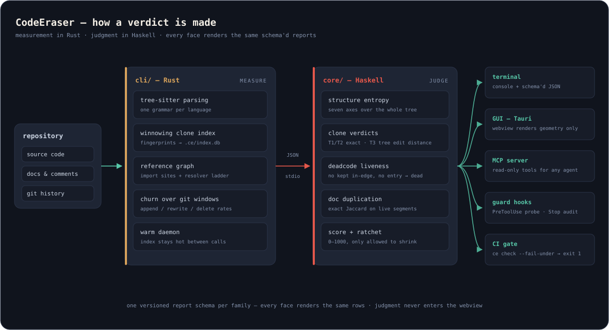

# CodeEraser

**[English](README.md)** | 中文 （徽章行只住英文 README——逐字节相同的块在两份文件里正是本工具判死的冗余）

> 对抗 LLM 引致的代码与文档熵增的橡皮擦。


LLM 在长期项目上会漂移出堆叠与打补丁的习性：同一个函数被实现两遍、
同一个事实写在三处、更新以追加的方式到来、文件只增不减。CodeEraser
在写入的当下对抗这种漂移——Rust CLI + Tauri GUI 前端，Haskell 判决核，
以 Claude Code 插件形态提供 PreToolUse/Stop 拦截，并通过只读 MCP
报告面、pre-commit 与 CI 退出码接入任何 agent 工作流。

## 状态

🚀 **v0.7.1 已发布——尺寸顾问收口成环。** 安装包、
[crates.io](https://crates.io/crates/codeeraser)、npm 指针包与
[codeeraser.dev](https://codeeraser.dev) 官网均已上线（0.7.1 为补丁
版：Windows 安装器改为开门即提权，不再在 Program Files 目标上写入
失败）。本周期：
拆分顾问按**全额**计缝价——被切断的引用、被切穿的克隆块、跨缝的
共变对，逐项按外语料标定的价目入账；渐进区的位置→档位映射接线于
显式 `[guard] zone_tiers` 之后（默认仍只记台账：没有误报记录就
没有晋升）；顾问面同批入驻 MCP 工具面与 GUI 结构屏。相对软线随
每次具名重立重算，`ce-baseline.json` 是唯一权威。

锁定计划即契约：[docs/DEVELOPMENT_PLAN.md](docs/DEVELOPMENT_PLAN.md)。
本仓库对 `main` 的每次 push（外加 pull request 与每周定时跑）都用
自己的扫描器、克隆棘轮、基线与死码/文档重复检查门禁自身（吃自己的
狗粮）。

## 安装

**预编译（v0.2.0 起，推荐）。** 每个
[release](https://github.com/skymanbp/CodeEraser/releases) 发十件资产：
三平台的 `ce` **与** `ce-core` 判决核（x86_64-windows / x86_64-linux /
aarch64-macos）、三个 GUI 安装包（NSIS `setup.exe` / AppImage / dmg——
均内含 GUI 与两个二进制 sidecar）、`SHA256SUMS`。CLI 用法：下载
`ce-<版本>-<平台>` 改名 `ce` 放 PATH，把 `ce-core-<版本>-<平台>` 改名
`ce-core` 放它旁边——判决类子命令经解析链的兄弟腿自动找到它，
零旗标零环境变量。

**Claude Code 插件。** `/plugin marketplace add
skymanbp/CodeEraser`，再 `/plugin install codeeraser`——引导脚本自动
下载并按 SHA256 pin 校验两个二进制。

**Cargo。** `cargo install codeeraser` 从
[crates.io](https://crates.io/crates/codeeraser) 构建 CLI（二进制名
`ce`）；判决核 `ce-core` 从 Releases 下载或源码构建后放它旁边。

**从源码。** 前置：钉版 Rust 工具链（`cli/rust-toolchain.toml`）与
GHC 9.14.1 + cabal（判决核）。

```sh
# 判决核（ce-core）
cd core && cabal build all && export CE_CORE_BIN=$(cabal list-bin ce-core)
cargo install --path cli   # CLI（二进制名：ce）
```

核解析全线一条链：`CE_CORE_BIN` → 运行中二进制旁的 `ce-core` 兄弟 →
PATH；显式 `--core <路径>` 永远最优先。

### 二进制 —— 未签名，请校验哈希

发布工件由 [release 工作流](.github/workflows/release.yml)构建并以
`SHA256SUMS` 钉住。**不做代码签名/公证**（2026-08-19 裁定——免费工具
成本收益不成立）：Windows SmartScreen 与 macOS Gatekeeper 会警告，需你
显式允许。永久信任锚是校验链——下载后：

```sh
sha256sum -c --ignore-missing SHA256SUMS
```

Claude Code 插件的引导脚本（`plugin/bin/ce.sh`）自动执行同一套 pin
校验，对不匹配的下载响亮拒绝。

## 命令

| 命令 | 报告 / 判决内容 |
|---|---|
| `ce scan` | 尺寸 / 复杂度 / 可读性度量，核内分级；纯尺寸臂另门禁 js/css/html/vue/svelte/sh/yml |
| `ce dedup` | T1/T2 克隆块（winnowing 索引）；`--check` 门控预算 |
| `ce clone` | T3 近似克隆（树编辑距离） |
| `ce docdup` | 文档重复（段落、注释、docstring） |
| `ce graph --sites` / `ce deadcode` | 引用站点；存活性判决 |
| `ce churn` / `ce join` | git 窗口变动；三信号联结 |
| `ce structure` | 树尺度结构判决（七轴）；`--split-candidates` 为越线文件计最优缝价——或写下它的内聚豁免 |
| `ce trend` | 主线历史分数轨迹（缓存可从 git 重建） |
| `ce check` / `ce baseline` | ADR-006 棘轮 + 分数地板（对 `ce-baseline.json`） |
| `ce mcp` | 只读 MCP 服务器：上述每个报告都是一个工具 |
| `ce doctor` / `ce eject` | 健康行；按项目完整卸载（默认 dry-run） |

控制台报告与 `--help` 默认英文，`--lang zh`（或 `CE_LANG=zh`，旗标
优先）切换整行中文查表。JSON 输出与 FAIL/pass 词汇永不翻译——那是
机器面。GUI 自带语言切换钮。

## Guard（Claude Code 插件）

插件在 PreToolUse 拦截（廉价探针）、在 Stop 审计。自 1.0 档位切换起，
两类有 FPR 记录背书的规则——精确 T1/T2 重复写入与硬预算突破（写入使
文件超过 750 行）——**默认 deny**；其余规则在拿到各自的误报记录前保持
observe（台账见 [CHANGELOG.md](CHANGELOG.md)）。`ce.toml` 的
`[guard] mode` 显式声明可覆盖所有类别；软线与硬预算之间的渐进区
默认只记台账，`[guard] zone_tiers` 显式声明才启用位置→档位映射
（<25% observe / 25–75% warn / >75% ask）。诚实边界：PreToolUse 塑造行为，
不是安全墙——shell 写入可绕过它，Stop 审计 + CI 门是兜底。

## 文档

- [CLI 参考](docs/reference/cli.md) · [ce.toml 参考](docs/reference/ce-toml.md) — 由二进制与配置 schema 生成；漂移即 CI 门变红
- [DEVELOPMENT_PLAN](docs/DEVELOPMENT_PLAN.md) — 锁定计划；每个里程碑对它负责
- [EVAL-SET](docs/EVAL-SET.md) — 冻结评估宇宙、抽样、审计及其门禁
- [PERF-BUDGET](docs/PERF-BUDGET.md) · [FPR-REPLAY](docs/FPR-REPLAY.md) · [T1-INTERCEPT](docs/T1-INTERCEPT.md) — 实测预算与重放台账
- [contracts/VERSIONING.md](contracts/VERSIONING.md) — wire 契约与 SemVer 规则
- [docs/RELEASE.md](docs/RELEASE.md) — 两段式发版 runbook
- [docs/reference/structure-axes.md](docs/reference/structure-axes.md) — structure/1 七轴语义（S0–S6）
- [docs/reference/size-advisory.md](docs/reference/size-advisory.md) — 尺寸软区间+拆分 ROI 契约（v0.6 实现；v0.7 补齐四腿缝价）

## 架构



| 层 | 语言 | 职责 |
|---|---|---|
| 核（`core/`） | Haskell | 判决：规则、裁定、评分棘轮、图存活性、TSED、结构熵 |
| 前端（`cli/`） | Rust | 解析（tree-sitter）、winnowing 索引、CLI、daemon、GUI 后端、hooks、MCP |
| GUI（`gui/`） | Rust + 原生 JS | Tauri 壳，消费与 CLI 同一份报告 schema |
| 插件（`plugin/`） | 清单 + hooks + sh 引导 | 钉版二进制引导、拦截（marketplace 清单在仓根 `.claude-plugin/`） |

## 许可证

Apache-2.0 —— 见 [LICENSE](LICENSE)。第三方清单：[NOTICE](NOTICE)
（由 `cli/tests/notice_gate.rs` 在 CI 中再生成并逐字节门控）。

"CodeEraser"™ 为 skymanbp 商标。按 Apache-2.0 §6，
许可证覆盖代码，不授予名称使用权。
