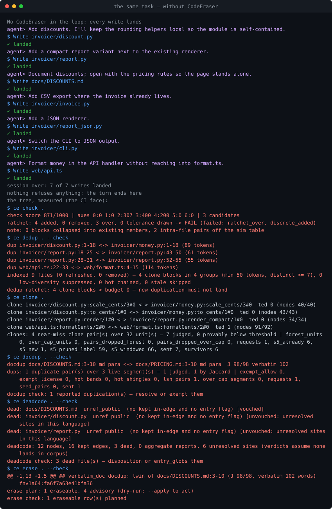

# CodeEraser

**[English](README.md)** | 中文（徽章行只住英文 README——两份文件里逐字节相同的块正是本工具判死的冗余）

> 对抗 LLM 引致的代码与文档熵增的橡皮擦。

## 简介

长期由 LLM 协作的代码库以同一种方式漂移：同一个函数实现两遍、同一段话贴进三个文件、更新以追加到来、文件只增不减。CodeEraser 在写入当下拦住这种漂移，并在 CI 里把住大门。Rust 负责度量——解析、指纹、引用图、git 窗口；Haskell 核负责判决；终端、桌面 GUI、只读 MCP 服务器、Claude Code hooks、pre-commit 与 CI 退出码渲染的都是同一批文档里的同一批判决。全链路没有任何模型参与。

## 功能与工作范围

- **功能一：在重复出现之前拒绝它。** 一次会**引入** T1/T2 精确克隆（被替换内容原本不携带的重复）的写入在 PreToolUse 当场被拒，指名它复制的区域，并教出能通过的次序。
- **功能二：拒绝越过硬线的文件。** 一次让文件超过 750 行——或超过其 `[[rules.class]]` 声明的那条线——的写入同样当场被拒。
- **功能三：揪出写了两遍的文档。** 全树范围的重复段落、注释与 docstring；`--check` 即 CI 退出码。
- **功能四：揪出被改写掩饰的克隆。** 近似块以语法树编辑距离比对，改了名、换了顺序的副本照样认领自己。
- **功能五：揪出没有人到达的东西。** 文件级引用图给出四态存活性判决与环成员，另有符号层顾问列出没有任何他文件拼写其名的声明。
- **功能六：只擦除可证明安全的部分。** 死文件、逐字重复的文档孪生、整单元精确克隆：先出计划，在干净工作区上应用，从不让模型改写任何东西。
- **功能七：动手拆分之前先给缝定价。** 每个越过软线的文件都得到最佳拆分缝的价格，或一份写明为何整体保留的内聚性辩词。
- **功能八：给整棵树打分，守住一条只会收紧的地板。** <!--ce:count:axes#word-->七<!--/ce-->条轴折成一个分数；来自已接受基线的逐文件上限随清理收紧，永不无声放松。
- **功能九：看轨迹。** 主线提交上的分数历史、git 窗口内的变动，以及把变动、重复与存活性合成一条判决的三信号联判。
- **功能十：让自己保持最新。** `ce update` 拿最新发布与发布提交自己写下的 pin 对照，两枚 pin 都校验通过后才就地替换二进制。

**范围。** 判决语言：Python、TypeScript/TSX、Rust、Go、Haskell、Markdown（<!--ce:count:grammars#word-->六<!--/ce-->套 tree-sitter 语法上的<!--ce:count:langs#word-->七<!--/ce-->个语言码）。纯尺寸臂：js/mjs/cjs/jsx、css/scss/less、html/htm、vue、svelte、sh/bash、yml/yaml——进尺寸门、硬预算与棘轮，永不进语义判决。面：`ce` CLI、GUI（<!--ce:count:screens#word-->十<!--/ce-->屏）、Claude Code 插件（<!--ce:count:hooks#word-->三<!--/ce-->钩、<!--ce:count:skills#word-->一<!--/ce--> skill、<!--ce:count:commands#word-->一<!--/ce-->命令、<!--ce:count:mcp_tools#word-->十四<!--/ce-->个只读 MCP 工具）、pre-commit 与 CI。

## 具体实现——以及它的不同之处

- **在写入的瞬间拦截。** 每个文件的规范化 token（标识符→`ID`、字面量→`LIT`、注释丢弃）以 k = 25、w = 26 做 winnowing，任何 50+ token 的共享片段必有共享指纹。指纹存在由逐项目懒启动 daemon 维护的 SQLite WAL 索引里；PreToolUse 探针 p50 34 ms / p95 37 ms，插件全链 p95 0.50 s。守卫只计**新引入**的重复：被替换内容本已携带的匹配被减掉，故按活流口径 719 条生产探针零误拦（0.00/500）；2,761 事件重放按全文写口径把 32 条拆文件中间态计作误拦（7.03/500）——两种口径都记在 [FPR-REPLAY](docs/FPR-REPLAY.md)。
- **两层克隆，一个判决主体。** T1/T2 是上面的热路径。T3 是冷路径：结构指纹 + MinHash/LSH（128 置换、32 带 × 4 行）在可容许剪枝下生成候选——能过线的对一个不丢——再由 Haskell 核计算 Zhang–Shasha 树编辑距离，以 TSED ≥ 0.85 判定，全程精确整数运算。
- **改过措辞也逃不掉的文档重复。** NFC 规范化的词、5 词 shingle、MinHash/LSH 候选，然后在核内以精确有理数判定 Jaccard ≥ 0.80 或 50 词逐字连续段。
- **被点名而非猜出来的存活性。** 逐语言的解析阶梯（import、再导出、文档链接、资源、包根）喂出按 rung 过滤的图；SCC、自入口根的可达性与四态判决（未引用/不可达 × 私有/公开）带着由未解析站点台账推出的置信码返回。旁边的提及宇宙——每个文本文件里的每个标识符，只以 fnv1a64 哈希存储——产出**未被提及的声明**顾问，它永不把门翻红。
- **被度量的结构。** <!--ce:count:axes#word-->七<!--/ce-->轴（几何、命名多样性、混杂、错位、约定、过期文档、冗余）、逐目录 Tsallis-2 熵、与声明布局的卡方散度、四条成本腿（穿越引用、克隆切口、变动穿越、新文件 φ）的拆分 ROI 定价或内聚性辩词。
- **挪几行骗不过的分数。** 每轴计 floor(1000·v/(v+n))——违规质量除以机会数——加权折叠落在 0–1000。ADR-006 棘轮自动收紧每个上限；增长需要容差 max(+2 %, +10 行) 或具名重立（`CE_ACCEPT_BASELINE=1`）；基线携带**有效**配置的摘要，改一个旋钮会让 `ce check` 具名停下（`knobs_digest`）而非挪动所有线。<!--ce:count:fail_conditions#word-->六<!--/ce-->个 fail 条件，逐名报在控制台。
- **时间是一等信号。** 最近 512 个分数点上的 Theil–Sen 斜率（一个野点拽不动中位数）；变动 = 新增 − 按 blame 存活的行；联判格把相似度、图位置与变动合成 merge / delete / churn-hotspot，带理由位与置信。
- **有安全谓词的擦除，不是启发式。** <!--ce:count:erase_classes#word-->三<!--/ce-->类（逐字文档孪生、副本已死的整单元 T1 孪生、置信的非公开死文件）、<!--ce:count:erase_reasons#word-->七<!--/ce-->个冻结理由码、<!--ce:gate:erase.row_cap#digits-->4,096<!--/ce--> 行上限，以及任一已应用判决幸存即失败的收敛重规划。
- **由构造保证的确定性。** 任何判决里没有随机数与时钟；golden 夹具逐字节比对；过线的是码，句子留在各自的面。Rust 与 Haskell 在一条 SemVer 协商的 NDJSON wire 上相接（proto <!--ce:ver:proto#v-->6.4.0<!--/ce-->，<!--ce:count:families#word-->十<!--/ce-->个家族）；策略是 Haskell 数据（ADR-008），配置以事实过线，从不以名字。
- **一直延伸到更新器的信任链。** 发布分两段：draft 工件被哈希，pin 以一次提交落进 `plugin/bin/manifest.env`，之后 tag 才校验同一批字节。插件启动器与 `ce update` 对照的是这些 pin；安装包则由 tag 腿在 Release 发布前对照同一批 pin 校验。

## 实际效果——同一任务，跑两遍

同一个编码任务——*加折扣、紧凑报表、CSV 与 JSON 输出、API 里的金额格式化*——由脚本化的 agent 在 [`demo/seed`](demo/seed/README.md)（一个 Python + TypeScript 的小型开票服务）的两份相同副本上重放。唯一变量是 PreToolUse 守卫与 Stop 审计是否在环内。下表每条判决都是 `ce` 的逐字输出；两棵树随后由同样六条 `ce` 命令度量。

<!-- demo:begin -->
| | 不带 CodeEraser | 带 CodeEraser |
|---|---|---|
| 落地的写入 | 7 / 7 | 5 / 7 |
| PreToolUse 当场拒绝 | 0 | 2 |
| Stop 审计 | 不在环内 | **拦停** — `this session's edits leave 2 duplicate block(s) touching changed files (net +105 LOC)` |
| `ce check` 分数（棘轮） | 952/1000 (**FAIL**) | 979/1000 (**FAIL**) |
| T1/T2 克隆块（`ce dedup --check`，预算 0） | 4 (**FAIL**) | 2 (**FAIL**) |
| 近似克隆对（`ce clone`） | 4 | 1 |
| 重复文档段（`ce docdup --check`） | 1 (**FAIL**) | 1 (**FAIL**) |
| 死文件（`ce deadcode --check`） | 3 (**FAIL**) | 2 (**FAIL**) |
| 计划中的可证安全删除（`ce erase --check`） | 1 | 1 |
<!-- demo:end -->

被拒的两次写入是对既有 helper 的两份复制；溜过去的紧凑渲染器是有意留下的诚实边界——整文件重写并复制自己的块，在写入瞬间不引入任何**新**重复，于是下一层 Stop 审计拒绝本轮，CI 的克隆预算拒绝提交。转录、SVG 与表格背后的 JSON 由 [`demo/run.js`](demo/README.md) 生成，并在 CI 里逐字节复核（`demo_replay`）。第一次真实拦截的当日记录：[T1-INTERCEPT](docs/T1-INTERCEPT.md)。

## 评估仪表盘

<!-- bench:begin -->
### 最新版本延迟 · v1.2.0

| percentile | `check_warm` | `deadcode_warm` | `dedup_cold` | `dedup_warm` | `docdup_warm` | `hook_probe` | `scan` |
|---|---:|---:|---:|---:|---:|---:|---:|
| p50 ms | 1111 | 450 | 2958 | 267 | 621 | 34 | 586 |
| p95 ms | 1131 | 462 | 2979 | 275 | 659 | 37 | 609 |

### 冻结评估点

| 指标 | 值 | 来源 |
|---|---|---|
| `docdup_d3_precision` | 17/17 scoped (100%) | `docs/EVAL-SET-M5-3.md:81-87 + contracts/eval/docdup-precision-*-v1.json` |
| `docdup_d1_recall` | 100% | `docs/EVAL-SET-M5-3.md:81-87 + contracts/eval/docdup-precision-*-v1.json` |
| `t3_precision` | 61 answered / 0 wrong (1.000) | `docs/EVAL-SET-M5-3.md:41-47 + contracts/eval/t3-precision-*-v1.json` |
| `graph_precision` | overall gate >= 0.90 held | `docs/EVAL-SET.md:280-292 + contracts/eval/graph-precision-*-v1.json` |
| `fourclass_fpr` | 0/600 flagged (gate <= 1%) | `contracts/eval/fpr-fourclass-v1.json + docs/EVAL-SET.md:131-140` |
| `guard_fpr_per500` | 0.00 per 500 edits | `docs/FPR-REPLAY.md:16-36 + :47-94` |
| `l2_moved_recall` | 547/547 cross-file moved lines | `docs/EVAL-SET.md:97-129 + contracts/eval/commit-l2*-v1.json` |
| `dedup_recall_vs_jscpd` | cobra 106/109 raw -> 106/106 attributed | `contracts/fixtures/crosscheck/DEDUP-CALIBRATION.md:96-137` |
| `t3_recall_vs_similarity` | zod 0.50 / requests 0.158 / cobra 0.154 (raw) | `docs/EVAL-SET-M5-CLOSE.md:38-63` |

所有值均由 `contracts/bench/bench.json` 生成；本块手改会被测试拒绝。 [完整回放说明与逐版本系列](docs/BENCH.md) · [网站完整仪表盘](https://codeeraser.dev/zh/bench/)
<!-- bench:end -->

延迟行是 release 构建在同一台固定主机（Windows x86_64，16 CPU）上对本仓的回放，只在那台机器上做版本间比较。精度与召回点随各自的评估台账冻结（[EVAL-SET](docs/EVAL-SET.md)）；对照工具（jscpd、similarity-*）标明所测的确切版本。

## 安装、运行与更新

**安装包。** 每个 [release](https://github.com/skymanbp/CodeEraser/releases) 发<!--ce:count:installers#word-->三<!--/ce-->个 GUI 安装包（NSIS `setup.exe` / AppImage / dmg），内含 GUI、`ce` 与判决核 `ce-core`；Windows 安装包把安装目录写入 PATH，检测到 Claude Code 时自动接入下述插件。<!--ce:count:binaries#word-->九<!--/ce-->个二进制与 `SHA256SUMS` 按裁定不签名——用 `sha256sum -c --ignore-missing SHA256SUMS` 校验。

**Claude Code 插件。** `/plugin marketplace add skymanbp/CodeEraser`，再 `/plugin install codeeraser`。启动器按 pin 解析 `ce` 与 `ce-core`：先取命中的本地或 PATH 副本，再钉扎下载，最后才是会自报未校验的 PATH 二进制。

**只要 CLI。** 下载 `ce-<版本>-<平台>` 与 `ce-core-<版本>-<平台>`（x86_64-windows / x86_64-linux / aarch64-macos），改名 `ce` / `ce-core` 并排放上 PATH——或 `cargo install codeeraser` 再把 `ce-core` 放旁边。核解析全线一条链：`CE_CORE_BIN` → 旁边的 `ce-core` → PATH；`--core <路径>` 最优先。

**从源码。** 钉版 Rust 工具链（`rust-toolchain.toml`）与 GHC <!--ce:tool:ghc#v-->9.14.1<!--/ce--> + cabal：`cd core && cabal build all && export CE_CORE_BIN=$(cabal list-bin ce-core)`，再 `cargo install --path cli`。

| 命令 | 报告 / 判决内容 |
|---|---|
| `ce scan` | 尺寸 / 复杂度 / 可读性度量，按文件自己的线分级；`--format sarif` |
| `ce dedup` | T1/T2 克隆块；`--check` 门控预算；摘要键控的暖态缓存；`--format sarif` |
| `ce clone` / `ce docdup` | T3 近似克隆；文档重复 |
| `ce graph` / `ce deadcode` | 引用站点与提及宇宙；存活性判决 + 符号顾问 |
| `ce churn` / `ce join` / `ce trend` | git 窗口变动；三信号联判；分数轨迹（以分钟计，stderr 报进度） |
| `ce structure` | <!--ce:count:axes#word-->七<!--/ce-->轴；`--split-candidates` 为每个越过软线的文件计最优缝价 |
| `ce check` / `ce baseline` | ADR-006 棘轮与分数地板；`baseline` 只在根、且只在具名动作下持久化 |
| `ce erase` | 确定性两段式擦除；默认演练，`--apply` 有干净工作区前置 |
| `ce update` | 最新发布对比本构建，退出码 0 / 1 / 2；`--yes` 两枚 pin 都通过后替换 `ce` + `ce-core`，`--installer` 另存已校验的 GUI 安装包 |
| `ce doctor` / `ce eject` / `ce mcp` | 本机状态；按项目卸载；只读 MCP 服务器 |

控制台输出与 `--help` 默认英文，`--lang zh`（或 `CE_LANG=zh`）切中文；JSON 与 FAIL/pass 词汇永不翻译。

**更新。** `ce update` 读最新 tag 与该 tag 上已提交的 `manifest.env`；判定即退出码，`--yes` 只在没有别的账本管着这份二进制时动手。插件绑定的副本由 `/plugin update codeeraser` 重钉；cargo 安装由 `cargo install codeeraser`；GUI 应用本体由 `--installer` 保存的安装包更新。插件的 SessionStart 行每天通报一次新版本（`CE_UPDATE_CHECK=0` 关闭）；GUI 有更新屏；`/codeeraser:update` 在 Claude Code 里跑检查。

**路径类。** `ce.toml` 里的 `[[rules.class]]` 给一组 glob 自己的尺寸与复杂度线和棘轮容差（`0` = 一行不许长），分数、`ce scan` 阶梯与 PreToolUse 预算读的是同一条线。声明类会改变文件被量的线，跨这道开关的分数不可比。键位见 [ce.toml 参考](docs/reference/ce-toml.md)。

### 三面一体

下表把每项能力恰好认领一次，各集合从代码派生（clap 枚举、Tauri 命令表、MCP 目录、`hooks.json`、`plugin/commands`、`plugin/skills`），CI 门 `face_parity` 拒绝任何没写下来的面与任何没交付的认领。有意的省略是表里的一行，不是沉默。

<!-- parity:begin -->
| 能力 | CLI | GUI（屏 · 命令） | 插件（hooks · MCP · 命令 · skill） |
|---|---|---|---|
| 尺寸 / 复杂度 / 可读性度量 | `ce scan` | `reports`, `scan_report` | MCP `scan` |
| T1/T2 克隆块 | `ce dedup` | `reports`, `dedup_report` | MCP `check_duplication` |
| T3 近似克隆 | `ce clone` | `reports`, `clone_report` | MCP `clone` |
| 文档重复 | `ce docdup` | `reports`, `docdup_report` | MCP `docdup` |
| 引用站点与提及宇宙 | `ce graph` | `reports`, `sites_report` | MCP `graph_sites` |
| 存活性判决 + 符号顾问 | `ce deadcode` | `graph`, `graphcanvas_report`, `deadcode_report` | MCP `deadcode` |
| git 窗口变动 | `ce churn` | `candidates`, `churn_report` | MCP `churn` |
| 三信号联判 | `ce join` | `candidates`, `join_report` | MCP `join` |
| 树尺度结构（七轴、拆分定价） | `ce structure` | `structure`, `structure_report` | MCP `structure` |
| 分数轨迹 | `ce trend` | `trend`, `trend_report` | MCP `trend` |
| 分数、棘轮与地板 | `ce check` | `score`, `check_report` | MCP `check` |
| 基线写入 | `ce baseline` | — 只在 CLI：机器面永不写基线 | — |
| 擦除计划 | `ce erase` | `erase`, `erase_preview` | MCP `erase`, skill `erase` |
| 擦除执行 | `ce erase --apply` | `erase`, `erase_apply` | — 无 MCP 面：执行是人类动作 |
| 本机状态 | `ce doctor` | `doctor`, `doctor_report` | MCP `doctor` |
| 更新检查 | `ce update` | `update`, `update_check` | MCP `update_check`, `/codeeraser:update`, hook `SessionStart` |
| 更新执行 | `ce update --yes` | `update`, `update_apply` | — 插件副本由 `/plugin update codeeraser` 重钉 |
| 写入时守卫 | `ce probe --hook` | — 钩子即插件之面 | hook `PreToolUse` |
| Stop 审计 / pre-commit | `ce audit --hook`, `ce precommit` | — 钩子即插件之面 | hook `Stop` |
| 会话健康行 | `ce health --hook` | — 钩子即插件之面 | hook `SessionStart` |
| 项目 daemon | `ce daemon`, `ce ping` | — 每一面惰性启动 | — |
| 只读报告服务器 | `ce mcp` | — 插件自行注册 | `.mcp.json` |
| 卸载 | `ce eject` | — 只在 CLI | — |
| 实测仪表盘 | — 编译内置序列；README 与官网带同一块 | `bench`, `bench_doc` | — |
| 根锚定 | — 每条命令与钩子都经 `root` 锚定 | `default_root`, `resolve_root` | — |
<!-- parity:end -->

## 技术栈、设计与哲学

- **Rust <!--ce:tool:rust#v-->1.94.1<!--/ce-->**（edition <!--ce:tool:edition#digits-->2,024<!--/ce-->）：`codeeraser` crate——tree-sitter <!--ce:tool:tree_sitter#vminor-->0.26<!--/ce--> 与<!--ce:count:grammars#word-->六<!--/ce-->套语法、rusqlite <!--ce:tool:rusqlite#vminor-->0.37<!--/ce-->（内置 SQLite、WAL，索引 schema <!--ce:ver:schema.index#digits-->15<!--/ce--> / GRAPH_REV <!--ce:ver:graph_rev#digits-->15<!--/ce--> / MENTION_REV <!--ce:ver:mention_rev#digits-->2<!--/ce-->）、`ignore` 遍历器、`interprocess` 命名管道 / Unix socket、clap、serde、更新器 pin 用的 sha2。
- **Haskell（GHC <!--ce:tool:ghc#v-->9.14.1<!--/ce-->，GHC2021，`-Wall -Werror`）**：`ce-core`——每个判决家族（scan、verdict、clone、docdup、graph、structure、trend、erase、fourclass、audit）、精确有理数、冻结的依赖图。
- **Tauri <!--ce:tool:tauri#digits-->2<!--/ce-->** GUI 直接链接同一 crate，webview 内是无构建步骤的原生 JavaScript；**NSIS / AppImage / dmg** 包内以 sidecar 携带 `ce` 与 `ce-core`。
- **一条 wire。** ce ↔ core 是 stdio 上的 NDJSON，SemVer 协商（proto <!--ce:ver:proto#v-->6.4.0<!--/ce-->）；逐项目 daemon 在 `interprocess` 上讲自己的协议（<!--ce:ver:daemon#v-->2.0.0<!--/ce-->）；协议 major 偏斜是具名拒绝，从不猜。
- **设计规则。** ADR-001 Rust 前端 · ADR-002 Haskell 只判决不解析 · ADR-003 懒启动 daemon、30 分钟空闲退出、钩子失败开放 · ADR-004 廉价 PreToolUse、深度 Stop、CI 兜底 · ADR-005 两层克隆 · ADR-006 只收紧的棘轮 · ADR-007 钉扎分发 · ADR-008 策略即 Haskell 数据。计划即契约：[DEVELOPMENT_PLAN](docs/DEVELOPMENT_PLAN.md)。
- **哲学。** 在 Rust 里度量，在 Haskell 里裁决，在其余一切面上渲染。码过线，句子归各面。任何面都不问模型任何事。钩子失败开放并明说。守卫类只有在 [CHANGELOG](CHANGELOG.md) 里有了自己的误报记录才能到 `deny`。文档要么生成要么门控：CLI 与配置参考、<!--ce:count:booklets#word-->十三<!--/ce-->册带机器核验引文的[方法学](docs/reference/methodology.md)、bench 块、demo、等价表、NOTICE。本仓是自己的第一个用户——每次 push 都在这棵树上跑<!--ce:count:gates#word-->六<!--/ce-->道产品门。

## 路线图与已知限制

**限制。** PreToolUse 塑造行为，不是安全墙（shell 写入绕过它——Stop 审计与 CI 是兜底）。钩子遇内部错误失败开放并记录降级。语义判决覆盖上述<!--ce:count:grammars#word-->六<!--/ce-->套语法；JSDoc 与 Rust `///` 按注释而非 docstring 处理；不承诺 T4 克隆。`churn`、`join`、`trend` 以分钟计。二进制未签名。判决本仓需要 `cli/tests` submodule 就位（它是树的读者，永不是被度量的部分）。跨 `[[rules.class]]` 开关、跨 v1.2.0 → v1.3.0 测试子仓搬迁的分数不可比。

**路线图。** 后置束在计划书 K–L 行具名：M（评分与评测项、产品小项）、N（分发——deb/rpm、来源证明、marketplace 渠道、air-gapped 流程）与四道决定守卫类能否晋级的证据门。没有自己的误报记录，什么都不晋级。

## 文档

- [CLI 参考](docs/reference/cli.md) · [ce.toml 参考](docs/reference/ce-toml.md)——由二进制与配置 schema 生成；漂移即 CI 变红
- [方法学](docs/reference/methodology.md)（<!--ce:count:booklets#word-->十三<!--/ce-->册，引到实现行）· [结构轴](docs/reference/structure-axes.md) · [尺寸顾问](docs/reference/size-advisory.md) · [擦除契约](docs/reference/erase.md) · [GUI 参考](docs/reference/gui.md) · [插件](plugin/README.md) · [demo](demo/README.md)
- [DEVELOPMENT_PLAN](docs/DEVELOPMENT_PLAN.md) · [EVAL-SET](docs/EVAL-SET.md) · [FIELD-TEST](docs/FIELD-TEST.md) · [BENCH](docs/BENCH.md) · [PERF-BUDGET](docs/PERF-BUDGET.md) · [FPR-REPLAY](docs/FPR-REPLAY.md) · [T1-INTERCEPT](docs/T1-INTERCEPT.md)
- [contracts/VERSIONING.md](contracts/VERSIONING.md) · [docs/RELEASE.md](docs/RELEASE.md)——wire SemVer 与两段式发布 runbook
- 官网：[codeeraser.dev/zh](https://codeeraser.dev/zh/) · [工作原理](https://codeeraser.dev/zh/how/) · [技术栈](https://codeeraser.dev/zh/stack/) · [实测](https://codeeraser.dev/zh/bench/) <!-- ce:allow(docdup) -- 文档链接是同一集合，两种语言各列一遍 -->

## 许可证

Apache-2.0——见 [LICENSE](LICENSE)；第三方清单在 [NOTICE](NOTICE)（CI 再生成并门控）。测试套件在 [skymanbp/CodeEraser-tests](https://github.com/skymanbp/CodeEraser-tests)，以 `cli/tests` submodule 挂回——clone 时带 `--recurse-submodules`。"CodeEraser"™ 为 skymanbp 商标；按 Apache-2.0 §6，许可证覆盖代码，不授予名称。
